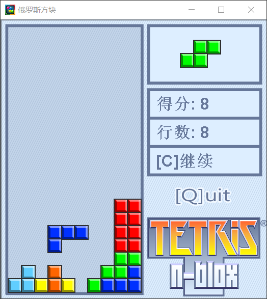

# Java俄罗斯方块游戏

功能说明：
- 每轮自动下落一格
- `←`：当前下落方块整体左移一格（支持越界检查）
- `→`：当前下落方块整体右移一格（支持越界检查）
- `↑`：当前下落方块整体右旋90°（支持越界检查）
- `↓`：当前下落方块整体加速下移一格（支持越界检查）
- `P`：游戏中暂停游戏
- `C`：暂停中继续游戏
- `S`：结束后重开游戏
- `Q`：直接退出游戏
- `×`：提示是否退出
- 支持得分统计
- 支持消除行数统计
- 支持下一个方块内容提示
- 填满的所有行会被清空

